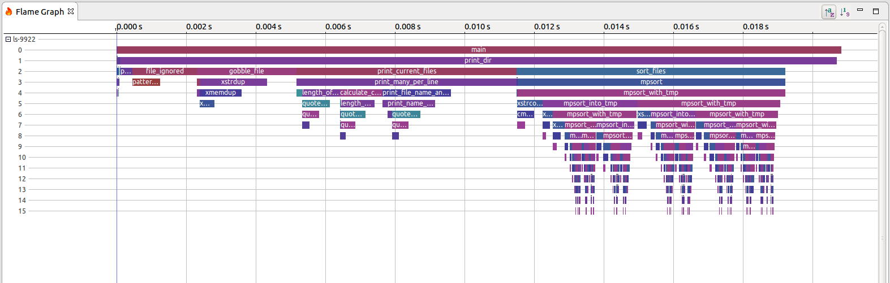

# tracing-realtime-multithreading-applications
Repository hosting several guides on how to trace real-time multi-threading
applications

## General problem

projekt architektury wielowątkowych aplikacji jest wymagajacy i czesto nie
pozostawia miejsca na błędy programisty.

Nieprzemyślane decyzje wpływają na obniżenie wydajności, lub w najbardziej
skrajnych przypadkach, zlego funkcjonowania oprogramowania.

W momencie review skomplikowanych - już istniejących systemów często nie
jestesmy w stanie polegac tylko na własnej intuicji.

W tym momencie przychodzą nam z pomocą narzędzia - w wielkiej mierze dostępne
jako aplikacje opensource - dostępne z przyjaznymi licencjami.

Poniżej przedstawiam najbardziej popularne narzędzia dostępne w praktycznie
każdej dystrybucji linuxa (często wymaga jednak przekompilowania jądra)

### top / htop

dla naiwnego porownania cpu load

### gprof - profilowanie - wyswietla czas spedzony w funkcji

[example](https://www.thegeekstuff.com/2012/08/gprof-tutorial/)

### perf - podobnie jak gprof tylko na troche nizszym poziomie

perf eventsy sa jakos podawane przez kernel i perf mam duzo opcji na zliczanie
ich.
`perf list` - wyswietla dostepne, po czym mozemy je sledzic

[fajne example](https://www.brendangregg.com/perf.html)

### lttng - winner

lttng daje mozliwosc traceowanie user-space'owej aplikacji, ale też
instrumentacji modułów kernela. daje to pełne spektrum analizy przy pełnej
instrumentacji fukcji. w skrócie, z bardzo małym overheadem rejstrujemy
wywołanie każdej funkcji w danej aplikacji / module kernela.

